<p align="center">
  
</p>

<h1 align="center">Servana One</h1>

<div align="center">


[](https://servanaone.github.io/Servana-One/) <p align="center">
  
</p>

**🎯 Technology solutions that don't break the bank**

</div>

---

## 🏆 Why Choose ServanaOne?

<div align="center">

```javascript
const servanaOne = {
    mission: "Premium technology solutions at affordable prices",
    promise: "High quality + Low cost + Fast delivery",
    specialization: ["Hardware", "Software", "IoT"],
    clientSatisfaction: "100%",
    costSaving: "Up to 60% less than competitors"
};

function getProject(budget, requirements) {
    return {
        quality: "Premium",
        price: "Affordable", 
        delivery: "Fast",
        support: "Reliable"
    };
}
```

</div>

### 💎 **Our Value Proposition**

| 💰 **Affordable Pricing** | 🏆 **Premium Quality** | ⚡ **Fast Delivery** |
|:---:|:---:|:---:|
| 40-60% cheaper than competitors | Enterprise-grade solutions | Rapid development cycles |
| Transparent pricing | No compromise on quality | Quick turnaround times |
| Flexible payment plans | Rigorous testing standards | Agile methodology |

---

## 🛠️ Complete Technology Solutions

We are a **technology solutions provider** specializing in comprehensive hardware and software development. From IoT ecosystems to custom applications, we deliver innovative solutions that drive business growth.

### 🔧 **Hardware Development**
```
🎯 End-to-End Custom Hardware Design
🔬 PCB Development to Full Embedded Systems  
⚡ Rapid Prototyping Solutions
```

<div align="center">


</div>

### 💻 **Software Solutions** 
```
🌐 Full-stack Development
📱 Cross-platform Applications
🔗 Seamless API Integration
```

<div align="center">


</div>

### 🌐 **IoT Ecosystems**
```
📡 Complete IoT Solutions
☁️ Device to Cloud Integration  
📊 Smart Analytics & Monitoring
```

<div align="center">


</div>

---

## 💡 What Makes Us Different?

<div align="center">

### 🎯 **Custom Solutions**
*Tailored technology solutions designed for your specific needs*

### ⚡ **Fast Delivery** 
*Rapid development cycles without compromising quality*

### 🛡️ **Reliable Support**
*Ongoing maintenance and support for all our solutions*

</div>

---


---

## 🚀 Our Process

```mermaid
graph LR
    A[💰 Free Quote] --> B[📋 Planning]
    B --> C[⚡ Development]
    C --> D[🧪 Testing]
    D --> E[🚀 Delivery]
    E --> F[🛡️ Support]
    
    style A fill:#FF6B35
    style B fill:#00D4AA
    style C fill:#2196F3
    style D fill:#4CAF50
    style E fill:#FF9800
    style F fill:#9C27B0
```

<div align="center">



</div>

---


## 🛠️ Technology Stack

<div align="center">

### **Hardware & Embedded**


### **Software Development**


### **Cloud & IoT**


</div>

---

## 🎯 Get Started Today

<div align="center">

### 💰 **Free Consultation & Quote**

```javascript
const startProject = {
    step1: "Share your requirements",
    step2: "Get free detailed quote", 
    step3: "Review our affordable pricing",
    step4: "Start building your solution",
    guarantee: "100% satisfaction or money back"
};

// Ready to save money while getting premium quality?
console.log("Contact us now! 🚀");
```

### 📞 **Contact ServanaOne**

[](mailto:oneservana@gmail.com)
[](https://www.linkedin.com/in/servana-one-280428385/)
[](https://www.instagram.com/servanaone/)

</div>

---

## 🏅 Our Guarantees

<div align="center">

| ✅ **Quality Guarantee** | 💰 **Price Match** | ⚡ **On-Time Delivery** | 🛡️ **Free Support** |
|:---:|:---:|:---:|:---:|
| Enterprise-grade quality | Beat any competitor price | Delivered as promised | 30 days post-delivery |

</div>

---


<div align="center">


### 💎 *"Premium Quality. Affordable Price. Your Success."*

**© 2025 ServanaOne. Making technology accessible for everyone.**

[](mailto:oneservana@gmail.com)

</div>
